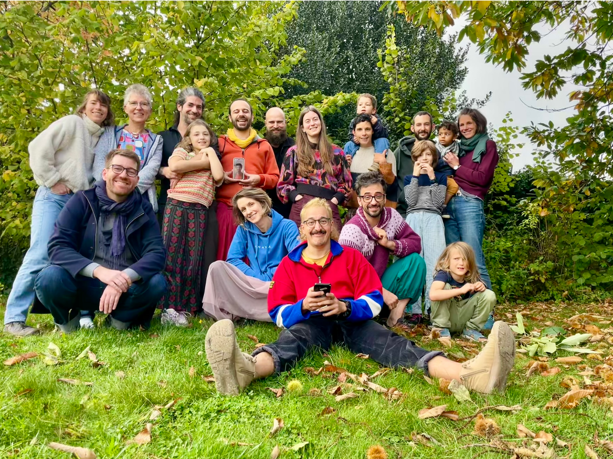


Let's shake up the way we live! A creative adventure, where adelphity, poetry, and robustness shine through.


Hagrou is a collective of citizens united by a shared dream: to rethink housing
in Brussels to make it more inclusive, more humane, and more connected to its
environment.

Our goal? To relearn how to live together, promoting sharing in both everyday
life and architecture. We envision a living space where common areas have their
rightful place: a community room open to residents and the neighborhood, a
shared laundry room, guest rooms for friends, a collaborative workshop...

Our approach aims to go beyond simple coexistence: no longer just living
side by side, but truly together.
